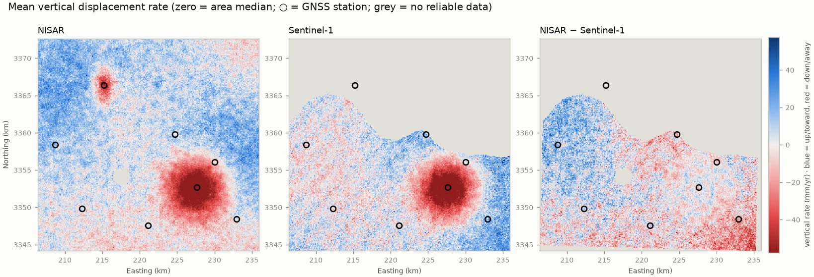

# NISAR vs Sentinel-1: side-by-side InSAR comparison

An application that **downloads NISAR (L-band) and Sentinel-1 (C-band) interferometric products over the
same area, puts them on one grid, and compares them side by side**. It explains what the results mean at
every step: coverage, coherence, agreement, artefacts, and which moving areas each satellite detects.



*Synthetic demo. A subsiding city is seen by both sensors (agreement r = 0.71, slope 1.02). A landslide
under forest is seen only by NISAR, because C-band loses coherence in vegetation. Grey = no reliable data.*

## Why compare them?

| | NISAR | Sentinel-1 |
|---|---|---|
| Wavelength | L-band, 24 cm | C-band, 5.6 cm |
| Motion per colour cycle (fringe) | ~12 cm | ~2.8 cm |
| Strength | Keeps coherence in vegetation and over long time gaps | More sensitive to small motion; 10-year archive |
| Weakness | ~20× more sensitive to the ionosphere | Loses coherence in forest and crops |

Where both agree, you have strong, independent evidence of real ground motion. Where only NISAR has data,
you may be looking at **new information**, such as motion under vegetation that Sentinel-1 could never see.

## What the application does

```
search ─► select pairs ─► download ─► load & crop ─► stack into rates ─► common reference ─► compare ─► report
   │            │                          │                │                   │                 │
   └────────────┴──── interpretation notes at every stage (plain language + the physics behind them)
```

1. **Search** ASF for NISAR L2 GUNW and Sentinel-1 (ARIA S1 GUNW or OPERA DISP-S1) over your area and dates.
   It picks a chain of sequential pairs from one viewing geometry per sensor. It also checks whether
   the two sensors' time windows overlap.
2. **Download** with your NASA Earthdata login. Files already present are reused.
3. **Load** each pair. Unwrapped phase is converted to line-of-sight displacement, with each product's
   sign convention handled so that positive always means toward the satellite. Pixels that could not
   be unwrapped are masked, and the NISAR ionospheric phase screen is applied.
4. **Stack** the pairs into a mean rate per sensor, and estimate the rate noise from pair-to-pair scatter.
   Rates can be projected to vertical.
5. **Reference** both maps the same way. Automatic mode uses the median over the pixels valid in both
   (zero = typical motion of the area). You can also give a known-stable point, such as bedrock or a GNSS
   station.
6. **Compare** the maps:
   - coverage, and the area only one sensor can measure
   - coherence
   - correlation, total-least-squares slope and RMS difference
   - the long-wavelength ramp in the difference map (ionosphere, orbits, troposphere)
   - moving areas each sensor detects, and whether the other confirms them
   - a sign-convention sanity check
7. **Validate** against independent published data (optional):
   - GNSS stations from the Nevada Geodetic Laboratory, downloaded automatically, with velocities fitted
     over the same period as the InSAR
   - or your own CSV of published station velocities (e.g. a table from a paper)
   - and/or any published velocity map (GeoTIFF/NetCDF): EGMS, LiCSAR/COMET, OPERA, or a paper's supplement
8. **Report:** a self-contained HTML report (light/dark), `metrics.json`, PNG figures, and GeoTIFFs
   you can open in QGIS or ArcGIS.

## Quick start: the graphical app (GUI)

Double-click the launcher for your system. The first start installs everything, which takes a few
minutes and needs Python 3.10+ from python.org:

| System | Launcher |
|---|---|
| Windows | `Start-GUI.bat` |
| macOS | `start-gui.command` |
| Linux | `start-gui.sh` |

The app opens in your web browser but runs **on your own computer**. In the sidebar:

1. Choose **Demo** to try it, **Search ASF** to download real data, or **Local files** for data you already have.
2. Set your area and dates. Optionally open **Validate against published data** and pick GNSS and/or upload a
   published velocity map.
3. Click **1 · Search** to see what will be downloaded, then **2 · Download & compare**.

Results appear in tabs: Displacement, Coherence, Agreement, Validation, Pairs, Interpretation, Downloads.

## Command line

```bash
python -m venv .venv && source .venv/bin/activate
pip install -e ".[app,dev]"

sarcompare gui                  # same as the launchers
sarcompare demo                 # synthetic run: no account, no download
sarcompare run my_area.yaml     # full workflow from a config file
pytest                          # tests
```

The demo writes synthetic products in the **real NISAR GUNW and ARIA GUNW file layouts**, so it runs the
same readers and pipeline as real data. It lands in `outputs/demo_synthetic/report.html`. Demo results
are clearly labelled as synthetic.

## Using real data

1. Create a free NASA Earthdata account: <https://urs.earthdata.nasa.gov>.
2. Give the app your credentials, using **one** of these:
   - `export EARTHDATA_TOKEN=...` (generate a token in your Earthdata profile)
   - `export EARTHDATA_USERNAME=... EARTHDATA_PASSWORD=...`
   - a `~/.netrc` line: `machine urs.earthdata.nasa.gov login <user> password <password>`
3. Copy and edit an example config, then:

```bash
sarcompare search examples/mexico_city.yaml     # see what exists and what would be downloaded
sarcompare run    examples/mexico_city.yaml     # full workflow + report
```

### Sentinel-1 sources

| `s1_source` | Coverage | Notes |
|---|---|---|
| `ARIA_S1_GUNW` | Selected regions (mainly the US, plus other areas) | Ready-made interferograms |
| `OPERA_DISP_S1` | North America | Ready-made displacement time series |
| `LOCAL` | **Anywhere** | Order HyP3 InSAR jobs in [ASF Vertex](https://search.asf.alaska.edu) (free), then put the zips in `s1_dir`. Tick "include look vectors" |

For areas outside ARIA/OPERA coverage (e.g. India), use HyP3 on-demand products with `s1_source: LOCAL`.

### Important settings (`Config` / YAML)

| Setting | Meaning |
|---|---|
| `aoi` | `[west, south, east, north]`, WKT, or a GeoJSON file |
| `start`, `end` | Date window. NISAR data start after its July 2025 launch |
| `coherence_threshold` | Ignore pixels below this coherence in each pair (default 0.35) |
| `max_pairs`, `min_span_days`, `max_span_days` | How many pairs, and how long each may be |
| `reference_lonlat` | A point you know is stable (bedrock, a GNSS station). Empty = area median |
| `gnss` | `NGL` (automatic GNSS), a path to a CSV (`site,lon,lat,up_mm_yr,up_sigma_mm_yr`), or empty |
| `published_maps` | List of `{path, label, units, component: vertical/LOS, sign, incidence_deg, period}` |
| `project_to_vertical` | LOS → vertical, assuming no horizontal motion |
| `nisar_sign`, `s1_sign` | Flip a product's sign convention if the sanity check flags a mismatch |

## Validating against published data

InSAR should always be checked against something independent. The app supports three kinds of reference data.

**GNSS (automatic, worldwide).** With `gnss: NGL`, the app:
1. downloads the Nevada Geodetic Laboratory station list;
2. keeps the stations inside your area that have data in your period;
3. downloads each station's daily positions (IGS20 `.tenv3`) and fits a vertical velocity over the
   **same period as the InSAR**;
4. samples both InSAR maps at each station.

InSAR is relative, so one constant offset per sensor is removed. The app then reports RMSE and correlation,
and says whether the misfit is within what the InSAR noise predicts. If both sensors need a large offset,
the reference area itself is moving, and the app tells you so.

**Published GNSS tables.** Many papers list station velocities. Put them in a CSV
(`site,lon,lat,up_mm_yr,up_sigma_mm_yr`) and set `gnss: that.csv`.

**Published velocity maps.** Point `published_maps` at, for example:

| Product | Region | Component | Units | Sign |
|---|---|---|---|---|
| EGMS Ortho (Copernicus) | Europe | vertical | mm/yr | + up |
| LiCSAR/COMET LiCSBAS velocities | Global (selected frames) | LOS | mm/yr | + toward satellite |
| OPERA DISP-S1 velocity | North America | LOS | m/yr | + toward satellite |
| Paper supplementary GeoTIFFs | varies | check the paper | check | check |

The map is converted to vertical mm/yr and referenced exactly like the InSAR maps. The app then reports
correlation, slope and RMS difference, with difference maps. Different time periods are the most common
reason for honest disagreement, so fill in `period`.

> Note: validation needs internet access to the data providers, so it runs on your computer. The demo
> includes synthetic GNSS files (in the real NGL formats) and a synthetic published map, so the whole
> validation path can be tried offline.

## How the code was checked

The readers were compared line by line with the published, widely used open-source tools that read the
same products:

- **NISAR GUNW:** dataset paths, the validity/water `mask` bit layout, and ionosphere handling follow
  [MintPy](https://github.com/insarlab/MintPy) `prep_nisar.py`. The file-name pattern follows opera-utils.
- **Sign conventions** (positive = toward the satellite):
  - NISAR and HyP3 phase are used as-is with −λ/4π (MintPy's convention).
  - ARIA phase is flipped (MintPy's `prep_aria`: "date2_date1 → date1_date2").
  - OPERA DISP-S1 is already toward-positive (dolphin, which produces it).
- **HyP3 incidence:** `90° − lv_theta`, with 0 = no data (MintPy).
- **OPERA:** `recommended_mask` (1 = good) and `spatial_ref.crs_wkt` (opera-utils).
- **GNSS:** NGL `DataHoldings.txt` and `.tenv3` column layout follow MintPy `objects/gnss.py`.
- **ASF search:** `processingLevel=GUNW` maps to the NISAR GUNW BETA/PROVISIONAL/V1 collections
  (asf_search).

The tests check each reader against a noise-free synthetic truth, the unit/LOS/sign conversions,
file-name parsing (including acquisitions that cross midnight), the GUNW mask decoding, and the full
pipeline.

## Reading the results responsibly

- **Rates are relative** to the reference point.
- **Vertical projection assumes no horizontal motion.** Landslides and faults also move sideways. Combine
  ascending and descending tracks to separate the two.
- **Short time spans are noisy.** Tropospheric water vapour adds centimetres per acquisition. The report
  gives a detection threshold (~2× the rate noise); trust signals above it.
- **Non-overlapping time windows** make seasonal motion look like disagreement.
- **Sign conventions** differ between products. If the rates are anti-correlated, the app says so. Verify
  against a feature you know before flipping a sign.
- The **interpretation is rule-based** and transparent (`sarcompare/interpret.py`). Treat it as a guide
  and validate with field data, GNSS, well levels, or optical imagery.

## Project layout

```
sarcompare/
  aoi.py          AOI parsing (bbox / WKT / GeoJSON) and UTM grid selection
  search.py       ASF search, local-folder scanning, pair selection, time-overlap notes
  download.py     Earthdata authentication and downloads
  readers/        NISAR GUNW (HDF5), ARIA GUNW, OPERA DISP-S1, HyP3 GeoTIFF readers
  processing.py   common grid, rate stacking, noise estimate, reference point, vertical projection
  compare.py      statistics, difference map, hotspot detection
  interpret.py    plain-language interpretation rules
  plots.py        side-by-side maps, scatter, histograms, timeline (light + dark)
  report.py       self-contained HTML report
  validate.py     GNSS (NGL / CSV) and published-map validation
  gui.py          graphical interface (sarcompare gui)
  pipeline.py     orchestration with per-stage events (used by the CLI and the web app)
  demo.py         synthetic scene written in real product layouts
app.py            alternative GUI entry point (streamlit run app.py)
Start-GUI.bat, start-gui.command, start-gui.sh   double-click launchers
examples/         example configs
tests/            unit + end-to-end tests
```

## Ideas to extend it

- Ascending + descending decomposition into vertical and east–west motion.
- Full SBAS time series (e.g. export to MintPy) instead of rate stacking, for seasonal signals.
- Backscatter comparison: NISAR GCOV vs OPERA RTC-S1 for vegetation, flooding and soil moisture.
- Tropospheric correction with weather-model products (e.g. OPERA TROPO) before comparing.
- Use GNSS east/north velocities and each sensor's LOS vector to validate in LOS, not only vertical.
